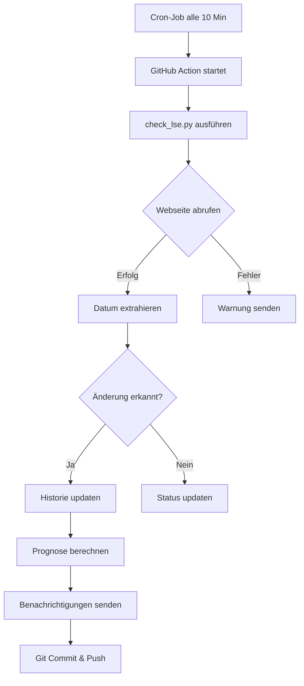

# LSE Status Monitor 🎓

Automatischer Monitor für die LSE (London School of Economics) Graduate Application Processing Times. Dieses Tool überwacht die offizielle LSE-Webseite und benachrichtigt bei Änderungen des Verarbeitungsdatums für "all other graduate applicants".

## 🚀 Features

- **Automatische Überwachung**: Prüft alle 10 Minuten die LSE-Webseite via Cron-Job
- **Multi-Channel Benachrichtigungen**: E-Mail (Gmail) und Telegram
- **Intelligente Benachrichtigungslogik**: Unterschiedliche Empfängergruppen für verschiedene Ereignisse
- **Verlaufstracking**: Speichert alle Änderungen in einer Historie
- **Prognose-System**: Berechnet basierend auf bisherigen Änderungen eine Vorhersage für zukünftige Daten
- **Fehlerbehandlung**: Benachrichtigt bei Problemen mit der Datenextraktion

## 📋 Systemübersicht

### Dateien im Repository

| Datei | Beschreibung |
|-------|--------------|
| `check_lse.py` | Hauptskript - Web Scraping, Datenanalyse und Benachrichtigungen |
| `monitor.yml` | GitHub Actions Workflow - Automatisierung und Scheduling |
| `status.json` | Speichert das zuletzt erkannte Datum und Zeitstempel |
| `history.json` | Verlauf aller erkannten Änderungen |

### Workflow



## 🔧 Konfiguration

### Erforderliche GitHub Secrets

| Secret | Beschreibung |
|--------|--------------|
| `GMAIL_USER` | Gmail E-Mail-Adresse für den Versand |
| `GMAIL_APP_PASSWORD` | Gmail App-spezifisches Passwort |
| `EMAIL_TO` | Hauptempfänger E-Mail |
| `EMAIL_TO_2` | Zweiter Empfänger (optional) |
| `EMAIL_TO_3` | Dritter Empfänger (optional) |
| `TELEGRAM_BOT_TOKEN` | Telegram Bot Token (optional) |
| `TELEGRAM_CHAT_ID` | Telegram Chat ID (optional) |

### Benachrichtigungslogik

1. **Immer benachrichtigen**: Empfänger ohne "engelquast" im E-Mail-Namen
2. **Bedingt benachrichtigen**: Empfänger mit "engelquast" im E-Mail-Namen (nur bei Erreichen von 25 July oder 28 July)

## 📊 Funktionen im Detail

### Web Scraping
- Sucht auf der LSE-Webseite nach "all other graduate applicants"
- Extrahiert das zugehörige Datum aus der Tabelle
- Fallback-Mechanismen für verschiedene HTML-Strukturen

### Prognose-System
- Nutzt lineare Regression basierend auf historischen Daten
- Berechnet voraussichtliche Daten für das Erreichen von 25 July und 28 July
- Zeigt R²-Wert für die Qualität der Vorhersage

### Datenstruktur

**status.json**
```json
{
  "last_date": "10 July",
  "last_check": "2025-07-28T18:40:29.045235"
}
```

**history.json**
```json
{
  "changes": [
    {
      "timestamp": "2025-07-28T18:40:29.045235",
      "date": "11 July",
      "from": "10 July"
    }
  ]
}
```

## 🚀 Installation & Setup

1. **Repository forken/klonen**
   ```bash
   git clone https://github.com/[YOUR-USERNAME]/lse-status-monitor.git
   ```

2. **GitHub Secrets konfigurieren**
   - Gehe zu Settings → Secrets and variables → Actions
   - Füge alle erforderlichen Secrets hinzu

3. **Cron-Job aktivieren**
   - Verwende einen externen Cron-Job Service (z.B. cron-job.org)
   - Konfiguriere einen POST Request alle 10 Minuten an:
     ```
     https://api.github.com/repos/[YOUR-USERNAME]/[REPO-NAME]/dispatches
     ```
   - Header: `Authorization: token [YOUR-GITHUB-TOKEN]`
   - Body: `{"event_type": "check-lse-status"}`

## 📈 Monitoring & Logs

- **GitHub Actions**: Siehe "Actions" Tab für Ausführungslogs
- **Status-Dateien**: Werden automatisch im Repository aktualisiert
- **Benachrichtigungen**: Erfolg/Fehler werden in den Action Logs protokolliert

## 🛠️ Wartung

### Bei Webseiten-Änderungen
Falls die LSE ihre Webseite umstrukturiert:
1. Prüfe die `extract_all_other_date()` Funktion in `check_lse.py`
2. Passe die Selektoren/Regex-Muster an
3. Teste lokal mit `python check_lse.py`

### Logs prüfen
```bash
# Letzte Änderungen anzeigen
cat history.json | jq '.changes[-5:]'

# Aktuellen Status prüfen
cat status.json
```

## 📝 Lizenz

Dieses Projekt ist für den persönlichen Gebrauch gedacht. Bei Nutzung bitte die LSE-Webseiten-Nutzungsbedingungen beachten.

## 🤝 Beitragen

Issues und Pull Requests sind willkommen! Besonders für:
- Verbesserungen der Datum-Extraktion
- Zusätzliche Benachrichtigungskanäle
- Optimierung der Prognose-Algorithmen

---

**Hinweis**: Dieses Tool ist nicht offiziell mit der LSE verbunden. Es dient ausschließlich zur persönlichen Information über öffentlich verfügbare Daten.
